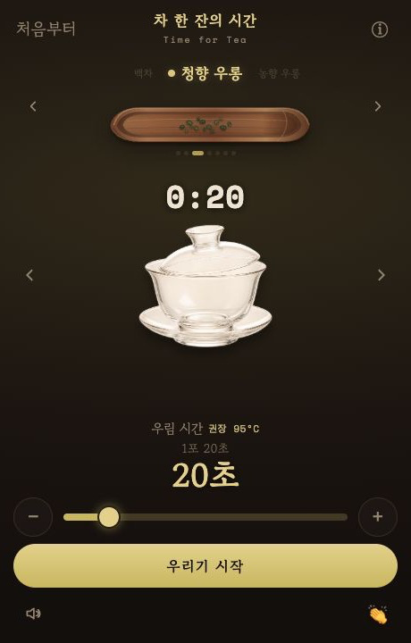
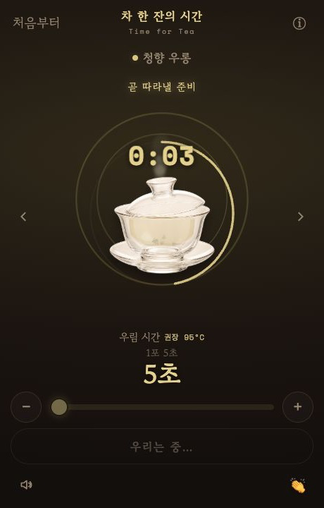
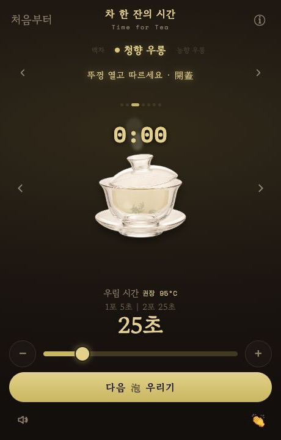

# Time for Tea

[한국어](README.md)

A small mobile web app for timing tea steeps.
You can always use a normal stopwatch, but I wanted something gentler, prettier, and more fitted to short 15- or 20-second infusions.

The interface still contains a little Korean, but most of the app is visual: choose a tea, choose a vessel, adjust the suggested time, and start brewing.

## Screenshots

<p align="center">
  
  
  
</p>

## What It Does

- Tea presets for green tea, white tea, light oolong, dark oolong, black tea, raw puer, and ripe puer
- Five brewing vessels: teapot, small teapot, gaiwan, mug, and Kamjove-style brewer
- Suggested steeping time and water temperature per tea
- Quick time adjustment with slider and `-` / `+` buttons
- Pre-finish warning sounds, countdown ticks, completion bell, and screen flash
- Wake Lock support while brewing
- Installable PWA structure for mobile use

## How To Use

1. Open the app in a browser or from your home screen.
2. Choose a brewing vessel with the arrows or swipe gesture.
3. Choose a tea.
4. Adjust the steeping time if needed, then press the start button.
5. When the alert fires, pour or separate the tea according to your vessel.
6. Use the next-steep button if you are brewing another infusion.

## Run Locally

The easiest way is to use the hosted version:
[winterrainlee.github.io/tea-timer](https://winterrainlee.github.io/tea-timer/)

To run it yourself:

```bash
git clone https://github.com/winterrainlee/tea-timer.git
cd tea-timer
python3 -m http.server 8123
```

Then open `http://localhost:8123` in your browser.

If you want to make your own changes on GitHub, fork this repository first, then clone your fork.

## Project Notes

- Main app: `index.html`
- Design notes: [DESIGN.md](DESIGN.md)
- Vessel images: `assets/vessels/*.png`
- Tea preview asset: `assets/tea-preview/chahe.svg`

This is a small personal project, still being shaped as I drink tea with it.
